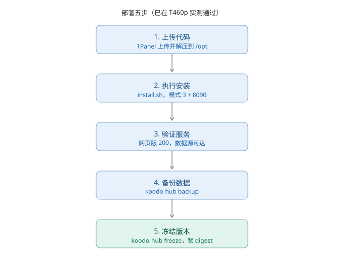
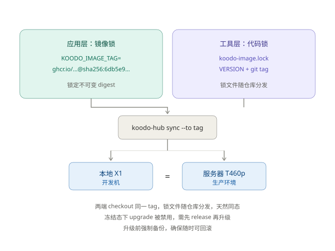

# 把书库搬回自己家：我用一台旧笔记本搭了 Koodo Reader 私有同步中枢

> 从想法到真机跑通，全程记录。附三张 4:3 图示、四个真实踩坑，以及两个意外发现。

## 一、起因：我的书，凭什么存在别人的服务器上

我有两台电脑、一部手机，后面还打算上平板和 Kindle。需求很朴素：**电脑上读到第 30 页，手机打开能接着读。**

Koodo Reader 是我用过最舒服的开源阅读器，但同步要么依赖官方服务，要么得自己折腾 WebDAV。对想彻底掌控数据的人来说，这不够。我想要的是：

- 数据 100% 私有，躺在我自己的 Ubuntu 服务器上；
- 多端无缝续读，不碰任何第三方云盘；
- 部署一次，之后升级、备份、回滚都不费脑子；
- 最好能开源出去，让别人也能复用。

于是有了 **koodo-sync-hub**。

先说清定位：**它不是 Koodo 的 fork，而是围绕官方 Docker 镜像的一键部署与运维工具集。** 不动上游一行源码，只做编排——这样合规干净（Koodo 是 AGPL-3.0，我们只编排不改动，仓库就能用 MIT + NOTICE 署名上游）。

## 二、整体架构


开发机写代码，上传到服务器；服务器用 Docker 跑两个容器：Caddy 做反代（对外 8090 是网页版、8091 是数据源），Koodo 提供数据源（容器内部 8080）和网页版（容器内部 80）。**所有客户端——两台电脑、手机、未来的平板和 Kindle——统一连同一个数据源地址 8091，且地址不带 `/datasource` 子路径**（这点后面踩了坑才搞清楚）。

为什么不直接用官方的 8080？因为服务器上 80/443 已经被 openresty 占了（装了 1Panel 的朋友应该都懂）。所以走 TLS 模式 3（纯 HTTP）+ 自定义端口 8090/8091，通过 Tailscale 访问——隧道本身已加密，不必再套证书。

> **一个必须先讲清的关键前提（血泪教训）**：Koodo 的 **Docker 数据源是「专业版 / Pro」独占功能**，免费版不开这个口子。官方镜像本身能跑，但要把阅读数据存到「自建数据源」而不是官方云，需要 Pro 授权（约 ¥25/年，我这边试用到 9 月 6 日）。**没有它，下面整套同步链路跑不起来。** 这点在动手前务必确认，否则会像我一样卡在「连得上、存不进」。

## 三、五步上线



看起来平平无奇的五步，实际每一步都藏着细节。真正耗时的不是"跑起来"，而是"稳得住"。

## 四、四个坑，都是真金白银换来的

这部分是全文最有价值的地方。四个 bug 全部出现在"看起来绝对不会出错"的地方。

**坑一：随机密码生成让脚本静默退出**

```bash
PASS="$(tr -dc 'A-Za-z0-9' </dev/urandom | head -c 16)"
```

这行代码单独跑毫无问题，但在 `set -euo pipefail` 下会直接终止脚本。`head -c 16` 读够字节后关闭管道，`tr` 收到 SIGPIPE 退出码非零，而 `pipefail` 会把整条管道判为失败。

表现极具迷惑性：向导问完最后一个问题，光标直接回到提示符，没有任何报错。加 `|| true` 解决。

**坑二：反向代理的 Host 头不匹配**

Caddyfile 原本写的是 `${HOST}:80`。客户端实际访问 `http://ibm-t460-dyz:8090`，Host 头带着 8090，和站点地址对不上，请求直接被拒。改成 `:80`（容器内固定端口，匹配任意 Host）才通。

**坑三：前缀被剥了两次**

`handle_path` 本身就自带前缀剥离，我又多写了一行 `uri strip_prefix`，等于把 `/datasource` 剥了两遍。同时 `/datasource/*` 匹配不到不带尾斜杠的请求，得改成 `/datasource*`。

**坑四：用容器 ID 读镜像属性**

`koodo-hub freeze` 里我用容器 ID 去读 `.RepoDigests`。但 `RepoDigests` 是**镜像**的属性，不是容器的，所以永远拿到空值，冻结功能一直报"无法获取 digest"。改成 `docker image inspect <镜像名>` 才对。

顺带修了一个更隐蔽的设计缺陷：原来的 freeze 只写锁文件，**没有真正锁住镜像**——`.env` 里还是 `:master` 这种可移动 tag，上游一重推就漂移，冻结形同虚设。现在 freeze 会同步把 `.env` 中的 `KOODO_IMAGE_TAG` 改写成 digest 形式，才算真的锁死。

**坑五：安卓端不接受 `/datasource` 子路径**

我一开始给数据源开了 `8090/datasource` 子路径（和官方文档示例一致）。台式机没问题，但安卓端 Koodo 死活「链接失败」。排查发现安卓客户端拼地址时对子路径处理有差异，连不上带前缀的写法。

解法很干脆：**给数据源单独开一个独立端口 8091，直连 `koodo:8080`，不带任何子路径**。所有客户端（电脑 + 手机）统一填 `http://<服务器>:8091`，一次全通。这也是为什么架构图里 8090 和 8091 拆成了两个端口。

**坑六：大文件上传被反代超时掐断（已解决）**

手机/电脑向数据源传书时，界面卡住半小时、最终失败。查 Caddy 日志看到 `POST /upload status:502 duration:310s`——默认 30 秒超时把大一点的书直接掐了。

已在 Caddyfile 给 8091 端口加上 10 分钟级别的 `response_header_timeout / read_timeout / write_timeout`，并去掉该路径的 gzip。**次日验证：X1 端 6 本书上传成功，手机端「导入云端图书」也成功刷出这 6 本。** 超时修复有效。

也是这次才更清楚：**Koodo 的同步是「增量合并」，不是整包覆盖**——每台设备都能上传自己的增量，所以大文件基本是逐本传，5G 书库建议分批导入别一次性怼。

## 五、版本冻结：跟新与锁死，要能对称共存



我的原则是：版本一旦定稿就冻结固化，且本地开发机和服务器保持同一冻结态，杜绝"服务器升级了、笔记本还停在旧版"这种漂移。

设计是**两层双锁**：

- **应用层**：镜像锁到不可变的 `sha256` digest；
- **工具层**：代码锁到 git tag，`koodo-image.lock` 随仓库分发。

两端靠 git 同态：定稿时打 tag 并 push，各自 `koodo-hub sync --to <tag>`，天然一致。要升级就 `release` 解锁 → `upgrade` → 满意再 `freeze` 固化新一轮基线，升级前强制先备份，随时可回滚。

## 六、两个意外发现

查官方文档时挖到的，对后续规划影响很大：

**1. 官方镜像内置 KOReader 同步服务器。** 设 `ENABLE_KOREADER_SERVER=true` 即可启用，端口 7200，协议与 kosync 官方完全兼容。这意味着 Kindle 装 KOReader 后**可以直接跟 Koodo 同步阅读进度**——原本我准备自己搭 kosync 服务器，现在全省了。

**2. 内置 OPDS。** `ENABLE_OPDS=true` 开启后，地址是「数据源地址 + `/opds`」，平板或任何第三方阅读器都能直接取书，对平板接入很有用。

这两项我故意没加进当前部署——会扩大验证面。先保证同步主链路跑通，再逐个打开。

## 七、当前进度与下一步

**已完成（截至 2026-08-31）**：

- 需求框架、开源规划、版本冻结策略、代码骨架全部落地；
- 真实服务器（T460p / Ubuntu）完成部署验证：网页版 8090 返回 200、数据源 8091 可达，备份与冻结均已执行，镜像锁定为不可变 digest（v0.1.3 已冻结）；
- **客户端实测接入**：X1 开发机绑定 8091 成功，6 本书上传成功；安卓手机装好 Tailscale + Koodo，绑定 8091 成功，「导入云端图书」成功刷出这 6 本；
- 已确认两个关键事实：① Docker 数据源是 Pro 功能；② 同步是增量合并、非整包覆盖。

**进行中 / 待验证**：

1. 5G 书库分批导入；
2. 两端「Koodo Sync 官方云」开关清理（需要进度/笔记跨设备同步就打开，想要纯私有就关掉）。

**下一步**：

1. 建 GitHub 仓库，打第一个 tag，把 `koodo-image.lock` 随仓库分发；
2. 补 cron 自动备份与恢复演练（升级前强制先备份，可回滚）；
3. 阶段二：平板接入 + Kindle 走 KOReader 同步（内置 7200 端口 kosync 服务器）。

最后一句体感：**自建服务的难点从来不在"跑起来"，而在"稳得住、升得动、回得去"。** 版本冻结和备份恢复，比任何炫技的架构都重要。

---

*本文记录于 2026-08-30，项目当前版本 v0.1.3，已冻结。仓库将在客户端同步验证完成后公开。*
