# 第 5 期｜书终于"回家"了：手机刷出那 6 本书的瞬间

> 上一期结尾我留了个尾巴——书传不上去，卡了半小时。这期接着讲：怎么通的，通了之后又冒出来的两个新问题，以及一个所有人都该知道的提醒。

## 一、卡住的上传，通了

上次书传一半就卡住，半小时不动，最后失败。

查服务器的"门卫日志"（就是负责转发请求的那个程序），看到一句话：
`POST /upload status:502 duration:310s`——**请求被掐断在 310 秒。**

原因其实很朴素：门卫默认只等 **30 秒**，书稍微大一点，传不完就被判定"超时、断开"。

改法也简单：把等待时间放宽到 **10 分钟**，同时关掉这段的压缩（压缩大文件反而更慢）。

**结果：第二天早上打开电脑，6 本书全部上传完毕。**

> 一句话记住：自建服务里，"卡住不动"十有八九不是网速问题，是某个地方设了太短的等待时间。

## 二、里程碑：手机刷出了这 6 本书

书进服务器之后，我拿起手机——装好 Koodo、连上家里的私密网络（Tailscale，可以理解为"只有你自己的设备能进的专用通道"），点「导入云端图书」。

**6 本书，整整齐齐出现在手机的书架上。**

这意味着整条链路第一次真正跑通了：

```
电脑传书  →  自家服务器  →  手机取出
```

不是演示，不是截图，是真机跑出来的。到这一步，"多端同步"这件事才算落地。

## 三、那个弹窗：点了会怎样，不点会怎样

手机刚连上就弹了个框，问要不要启用 **Koodo Sync**。很多人会随手一点，但它决定了你的数据去哪，值得说清楚。

**Koodo 里有两条完全独立的通道：**

| | 走哪儿 | 存什么 |
|---|---|---|
| **Koodo Sync**（官方云） | 开发商的服务器 | 读到第几页、笔记、划线、书签 |
| **自建数据源**（我们搭的） | 你家服务器 | 书文件、封面 |

**刚刚我又拿另一台没装 Tailscale 的手机试了一次：** 登录 Koodo 后，书名、阅读进度、评论全同步过来了，但封面是错的、也点不开书。这正好印证上表——**官方云把元数据同步了，但书文件和封面必须连上 8091 数据源才能拿到**。没装 Tailscale 的新手机根本进不了你家服务器，所以只有"骨架"没有"肉"。

所以：

- **点「确认」**：进度和笔记走官方云（加密的），**书和封面仍然只在你家服务器**。手机能接着电脑上次的页码读——这正是我们要的。
- **点「取消」**：完全不上云，但进度、笔记就没法跨设备同步了。

**我的建议：点确认。** 毕竟"电脑上读到第 30 页，手机打开接着读"这个体验，就靠它。而书——真正有分量、也真正私有的东西——始终在你自己手里。

## 四、最重要的一件事：书全在服务器了，得备份吗？

**必须备。而且这一条比前面所有技术细节都重要。**

以前你的书在移动硬盘上，硬盘本身就是备份。现在书全进了服务器，**服务器成了唯一一份**——硬盘哪天坏了，书就没了。

而且有个反直觉的点：**官方云救不了你的书。** 它只存进度和笔记，不存书文件。服务器挂了，进度还在，书没了。



**记两条就够了：**

1. **备份要有，但不能只存在服务器自己身上。** 服务器上跑一次备份命令，备份文件也躺在那块盘上，盘坏了一起没。
2. **至少再拷一份到别处**——移动硬盘、另一台电脑、网盘，都行。

操作就一行：

```
./koodo-hub backup      # 打包书库，然后记得把打包文件拷出服务器
```

> 顺带回答一个常被问的问题：能不能把移动硬盘上所有书都导进来、以后只存一个地方？
> **能，而且正该这么做。** 但同样的道理——导完之后，备份的责任就从硬盘转移到了你身上。**移动硬盘先别急着格式化**，等自动备份跑顺了，它再退役成纯冷备。

## 五、项目定版 1.0，准备开源

这两天顺手把整个项目收拾干净了：

- **定版 1.0**：版本锁死，装一次，版本永久一致，不会因为上游更新而莫名其妙变样。
- **写好操作说明**：从安装、连客户端、导书、到备份恢复，一步步都有。
- **写了注意事项**：8 条必读，包括"自建数据源其实是付费功能（约 25 元/年）"这种容易踩的坑，都写在最显眼的地方。
- **准备开源到 GitHub**：许可证、署名、安全项都按规矩处理好了（我们只是把官方的东西编排起来，不动它一行源码，这一点必须干净）。

## 下期预告

书库打通了，接下来是**第二阶段**：让平板和 Kindle 也接进来。

好消息是查文档时发现，官方镜像里**已经内置了两个开关**——一个专门对接 Kindle 上的 KOReader，一个是对外的取书接口（OPDS）。本来以为要自己搭服务器，现在全省了。

> 体感一句话：**自建服务最难的不是"跑起来"，是"稳得住、升得动、回得去"。** 备份和版本锁定，比任何炫技的架构都重要。

---

*第 5 期 · 记录于 2026-08-31 · 项目版本 v1.0.0*
